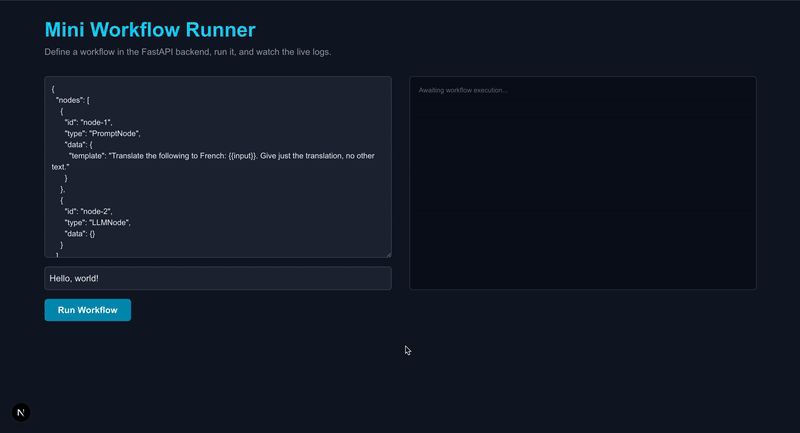

# Full-Stack Workflow Runner

This project is a lean end-to-end prototype of a workflow runner. It features a decoupled architecture with a **FastAPI (Python) backend** and a **Next.js (React/TypeScript) frontend**.

The service allows a user to define a two-step workflow via JSON, execute it against the real Google Gemini LLM, and watch the progress live through a minimal UI.

 <!-- Placeholder: Replace with a real GIF of your app working! -->

  

---

## Architecture Overview

-   **Frontend**: A Next.js single-page application that provides the user interface for defining and running workflows. It runs on `http://localhost:3000`.
-   **Backend**: A FastAPI server that exposes a REST API for creating and executing workflows. It handles all orchestration, validation, and communication with the Gemini API. It runs on `http://localhost:8000`.
-   **Communication**: The frontend communicates with the backend via HTTP requests. For live log updates, it uses **Server-Sent Events (SSE)** to stream data from the backend in real-time.
-   **LLM Integration**: The backend calls the **Google Gemini API** to perform the LLM generation step.

## Core Features

-   **Define Workflows**: `POST /api/workflows` to create a workflow from a JSON spec.
-   **Run Workflows**: `POST /api/workflows/{id}/run` to execute a defined workflow.
-   **Live Log Streaming**: Uses Server-Sent Events (SSE) to stream per-step status and logs to the UI in real-time.
-   **In-Memory Persistence**: Stores workflow definitions in the backend's memory (data resets on restart).
-   **Resilient Execution**: Implements a retry-on-failure mechanism for the LLM API call.
-   **Real LLM Integration**: Uses the Google Gemini API for text generation.

---

## Tech Stack

-   **Backend**: Python, FastAPI, Pydantic, HTTPX
-   **Frontend**: Next.js, React, TypeScript, Tailwind CSS
-   **Streaming**: Server-Sent Events (SSE)
-   **LLM**: Google Gemini API

---

## Setup & Run Instructions

### Prerequisites

-   Python 3.9+
-   Node.js 18+
-   A Google Gemini API Key. Get one from [Google AI Studio](https://aistudio.google.com/app/apikey).

### 1. Clone the Repository

```bash
git clone <your-repo-url>
cd fullstack-workflow-runner
```

### 2. Navigate to the backend directory
```bash
cd backend-fastapi
```

#### Create and activate a Python virtual environment
```bash
python3 -m venv venv
source venv/bin/activate  # On Windows: venv\Scripts\activate
```

#### Install dependencies
```bash
pip install -r requirements.txt
```

#### Create the environment file for your API key
#### Create a file named .env and add your key:
```bash
echo 'GEMINI_API_KEY="YOUR_API_KEY_HERE"' > .env
```

#### Run the backend server
```bash
uvicorn app.main:app --reload --port 8000
```


### 3. Set Up the Frontend
### In a new terminal window, set up and run the Next.js frontend.
#### Navigate to the frontend directory from the root
```bash
cd frontend-nextjs
```

#### Install dependencies
```bash
npm install
```
#### Run the frontend development server
```bash
npm run dev
```

### 4. Use the Application
Open your browser and navigate to http://localhost:3000. You can now define and run your workflows!
Example Workflow JSON
Paste this into the JSON textarea to get started:
```bash
{
  "nodes": [
    {
      "id": "prompt_step",
      "type": "PromptNode",
      "data": {
        "template": "Explain this concept in one simple sentence: {{input}}"
      }
    },
    {
      "id": "llm_step",
      "type": "LLMNode",
      "data": {}
    }
  ]
}
```
Use an input like "Quantum Computing" and click "Run Workflow".
